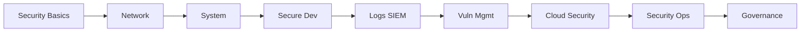

# Knowledge Structure

## 🔖 目次
- [カテゴリ一覧](#カテゴリ一覧)
- [カテゴリ相関図 (Mermaid)](#カテゴリ相関図-mermaid)
- [1. セキュリティの基本知識](#1-セキュリティの基本知識)
- [2. ネットワーク知識](#2-ネットワーク知識)
- [3. OSとシステムの理解](#3-osとシステムの理解)
- [4. セキュア開発と脆弱性理解](#4-セキュア開発と脆弱性理解)
- [5. ログ分析とSIEM活用](#5-ログ分析とsiem活用)
- [6. 脆弱性スキャニングと管理](#6-脆弱性スキャニングと管理)
- [7. クラウドセキュリティ](#7-クラウドセキュリティ)
- [8. セキュリティ運用・CSIRT・SOC](#8-セキュリティ運用-csirt-soc)
- [9. 法令・倫理・ガバナンス](#9-法令・倫理・ガバナンス)
- [10. ソフトスキル・言語・継続力](#10-ソフトスキル・言語・継続力)

## 📚 カテゴリ一覧
1. セキュリティの基本知識  
2. ネットワーク知識  
3. OSとシステムの理解  
4. セキュア開発と脆弱性理解  
5. ログ分析とSIEM活用  
6. 脆弱性スキャニングと管理  
7. クラウドセキュリティ  
8. セキュリティ運用・CSIRT・SOC  
9. 法令・倫理・ガバナンス  
10. ソフトスキル・言語・継続力  

## 🗺 カテゴリ相関図 (Mermaid)

*図：左から右へ学びを深める流れを示しています。*

---

### 1. セキュリティの基本知識

**Why（なぜ学ぶのか）**  
- 情報セキュリティの土台となる概念を理解しないと、以降の実践が曖昧になるため。  
- リスクを正しく評価し、適切な対策を選択できる基盤を築くため。

**What（何を学ぶのか）**  
- CIAトライアングル（機密性・完全性・可用性）  
- AAAモデル（認証／認可／アカウンティング）  
- 暗号化技術の基礎（対称鍵／公開鍵暗号／ハッシュ）  
- リスクマネジメントの用語（脅威、脆弱性、インパクト、リスク）

**How（どうやって実践するか）**  
1. **TryHackMe “Intro to Cyber Security”** を Docker コンテナで再現  
   ```bash
   docker run --rm -it tryhackme/intro-to-cybersec bash
   ```  
2. **Markdown スライド資料** を Zenn 記事にして公開  
3. **Anki カード** に用語と定義を登録し、毎日のレビューで定着化

---

### 2. ネットワーク知識

**Why（なぜ学ぶのか）**  
- ネットワークトラフィックの理解なくして異常検知は困難なため。  
- 攻撃経路やパケット解析スキルがセキュリティ対応に直結するため。

**What（何を学ぶのか）**  
- OSIモデルとTCP/IPプロトコル  
- パケットキャプチャ（tcpdump／Wireshark）  
- ファイアウォールとルーティングの基本  
- ネットワークセグメンテーションとACL  

**How（どうやって実践するか）**  
1. **Packet Capture & Analysis Lab** を Docker で実装  
   ```bash
   docker run --rm --network host nicolaka/netshoot tcpdump -w capture.pcap
   ```  
2. Wireshark で解析演習を行い、レポート作成  
3. **Zenn 記事** に所感とベストプラクティスをまとめる

---

### 3. OSとシステムの理解

**Why（なぜ学ぶのか）**  
- OSの動作原理を知らないと、脆弱性や権限昇格の原因を特定できないため。  
- システム全体の挙動を把握してセキュリティ設計に活かすため。

**What（何を学ぶのか）**  
- プロセスとスレッドの管理  
- ファイルシステムとアクセス権  
- システムコールとユーザースペース／カーネルスペース  
- 権限と脆弱性（SUID, CAPABILITIES）  

**How（どうやって実践するか）**  
1. **Linux権限昇格チャレンジ** を Docker で再現  
2. **Vagrant環境** で Windows AD/DC の基本構成を構築  
3. 各演習のスクリプトと結果を GitHub にまとめる

---

### 4. セキュア開発と脆弱性理解

**Why（なぜ学ぶのか）**  
- 脆弱なコードが本番環境に入り込むと、深刻な被害を招くため。  
- 開発の初期段階でセキュリティを組み込む習慣をつけるため。

**What（何を学ぶのか）**  
- OWASP Top10  
- セキュアコーディングガイドライン  
- SAST／DASTツールの基本  
- Dependency Management とSBOM

**How（どうやって実践するか）**  
1. **脆弱Webアプリ（OWASP Juice Shop）** を Docker で起動  
2. **Semgrep** でコード静的解析を実行  
3. SASTルールと結果を Readme にまとめる

---

### 5. ログ分析とSIEM活用

**Why（なぜ学ぶのか）**  
- ログはセキュリティ運用の“目”となる情報源であり、分析能力が必須。  
- SIEMで大量ログを集約・相関分析できるようになるため。

**What（何を学ぶのか）**  
- ログフォーマット（JSON, syslog）  
- Wazuh／ELKスタックの構成  
- アラートルールとダッシュボード設計  
- SIEM運用プロセス

**How（どうやって実践するか）**  
1. **Wazuh環境** を Docker Compose で構築  
2. Dockerコンテナのログを Wazuh に連携し、アラート作成  
3. ダッシュボードのスクリーンショット付きレポートを作成

---

### 6. 脆弱性スキャニングと管理

**Why（なぜ学ぶのか）**  
- 定期的な脆弱性スキャンでリスクを早期に発見することが重要。  
- スキャン結果を管理して適切に修正を追跡する必要があるため。

**What（何を学ぶのか）**  
- OpenVAS/GVMの基本  
- スキャンポリシーとレポート  
- パッチ管理のワークフロー  
- 脆弱性管理ツール連携

**How（どうやって実践するか）**  
1. **OpenVAS** を Docker で起動しスキャン実施  
2. スキャン結果を Markdown レポートにまとめる  
3. GitHub Issue を使い、修正フローを管理

---

### 7. クラウドセキュリティ

**Why（なぜ学ぶのか）**  
- クラウド環境ならではの設定ミスが大きなセキュリティリスクとなるため。  
- IaCによる再現性と自動化で安全性を高めるため。

**What（何を学ぶのか）**  
- AWS VPC／サブネット／セキュリティグループ  
- IAMポリシーとロール設計  
- Infrastructure as Code (Terraform)  
- クラウドベストプラクティス

**How（どうやって実践するか）**  
1. **Terraform** でセキュアな VPC+IAM を構築  
2. `terraform plan/apply` を CI で検証  
3. AWSコンソールの設定をドキュメント化

---

### 8. セキュリティ運用・CSIRT・SOC

**Why（なぜ学ぶのか）**  
- インシデント対応と運用プロセスを理解しないと、攻撃時に混乱が生じるため。  
- CSIRT/SOCの役割と連携が組織セキュリティを支える。

**What（何を学ぶのか）**  
- インシデント対応プロセス (NIST, SANS)  
- CSIRTの組織構成とワークフロー  
- SOARと自動化基盤  
- フォレンジックの基礎

**How（どうやって実践するか）**  
1. **Security Onion** を Vagrant で構築し、検知演習  
2. 模擬インシデントを作成し、対応手順をドキュメント化  
3. Playbookを Markdownで整理

---

### 9. 法令・倫理・ガバナンス

**Why（なぜ学ぶのか）**  
- コンプライアンス違反は企業リスクを大きくするため。  
- 倫理的視点を持たないとセキュリティ判断が偏るため。

**What（何を学ぶのか）**  
- プライバシー法制とGDPR概要  
- 情報セキュリティマネジメントシステム (ISMS)  
- 倫理的ハッキングガイドライン  
- 内部統制とガバナンスモデル

**How（どうやって実践するか）**  
1. **ISMS文書テンプレート** を GitHub で共有  
2. GDPRチェックリストを Markdownで作成  
3. 倫理的ハッカー事例をZennでまとめる

---

### 10. ソフトスキル・言語・継続力

**Why（なぜ学ぶのか）**  
- 技術だけでなく、コミュニケーションや継続力がプロジェクト成功を左右するため。  
- 多言語対応でグローバルにアピールするため。

**What（何を学ぶのか）**  
- チームコミュニケーションツール (Slack, Teams)  
- プレゼンテーションスキル  
- 英語技術文書の読み書き  
- PDCAサイクルと自己管理

**How（どうやって実践するか）**  
1. **週次振り返り記事** を Noteで公開  
2. **英語版README** を作成し、PRでマージ  
3. **継続学習ログ** を Obsidianで管理し、公開リンクを設置

---

*※以上で「Structure」レイヤーが全カテゴリ分完成しました。次は Proof レイヤーの詳細構築に入ります！*

